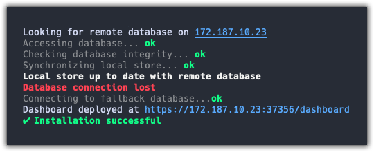
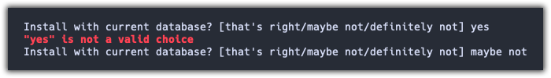

# Disgo

<p align="center">
    
</p>
<p align="center">
    <a href="#license">
        
    </a>
    <a href="https://godoc.org/github.com/Ullaakut/disgo">
        
    </a>
    <a href="https://goreportcard.com/report/github.com/Ullaakut/disgo">
        
    </a>
    <a href="https://github.com/Ullaakut/disgo/releases/latest">
        
    </a>
</p>

Simple output library for go CLIs.

Color provides three essential features for most user-friendly CLI applications:

1. Simple output levels (in `github.com/Ullaakut/disgo/logger`)
    - Debug outputs are like normal outputs, but are written only on a logger with enabled debug.
    - Error outputs can optionally be written on an error writer.
    - Info outputs are written on the standard writer, usually stdout, but it's configurable.
2. Output formatting (in `github.com/Ullaakut/disgo/logger`)
    - Important logs can be passed to `logger.Important()` which will format them into bold white text.
    - Success logs can be passed to `logger.Success()` which will format them into bold green text.
    - Failure logs can be passed to `logger.Failure()` which will format them into bold red text.
    - Link logs can be passed to `logger.Link()` which will format them into uinderlined blue text.
    - Trace logs can be passed to `logger.Trace()` which will format them into gray text.
3. Simple user prompting (in `github.com/Ullaakut/disgo/prompter`)
    - `prompter.Confirm` asks the user for a confirmation (true/false). Supports many inputs and is customizable (labels, choices and parsers can be changed easily).
    - **`TODO`**: `prompter.ReadString` asks the user for a string. A custom parser can be passed for validation purposes.

## Logging example

### Code

```go
package main

import (
    "os"

    "github.com/Ullaakut/disgo/logger"
)

func main() {
    log, err := logger.New(os.Stdout, logger.WithDebug(), logger.WithErrorOutput(os.Stderr))
    if err != nil {
        os.Exit(1)
    }

    log.Infoln("Looking for remote database on", logger.Link("172.187.10.23"))

    log.Debug(logger.Trace("Accessing database... "))
    log.Debugln(logger.Success("ok"))

    log.Debug(logger.Trace("Checking database integrity... "))
    log.Debugln(logger.Success("ok"))

    log.Debug(logger.Trace("Synchronizing local store... "))
    log.Debugln(logger.Success("ok"))

    log.Infoln(logger.Important("Local store up to date with remote database"))

    log.Infoln(logger.Failure("Database connection lost"))

    log.Info(logger.Trace("Connecting to fallback database..."))
    log.Infoln(logger.Success("ok"))

    log.Debugln("Dashboard deployed at", logger.Link("https://172.187.10.23:37356/dashboard"))
    log.Infoln(logger.Success("\xE2\x9C\x94 Installation successful"))
}
```

### Output

<p align="center">
    
</p>

## Simple confirmation prompt example

### Code

```go
package main

import (
    "os"

    "github.com/Ullaakut/disgo/prompter"
)

func main() {
    prompt := prompter.New(os.Stdout, os.Stdin, true)
    installWithCurrentDB, err := prompt.Confirm(prompter.Confirmation{
        Label:             "Install with current database?",
    })
    if err != nil {
        fmt.Fprintf(os.Stderr, "Unexpected user input: %v\n", err)
        os.Exit(1)
    }

    if installWithCurrentDB {
        // ...
    }
    // ...
}
```

### Output

`Install with current database? [y/n]`

## Advanced confirmation prompt example

### Code

```go
package main

import (
    "os"

    "github.com/Ullaakut/disgo/prompter"
)

func main() {
    prompt := prompter.New(os.Stdout, os.Stdin, true)
    confirmOptions := prompter.Confirmation{
        Label:             "Install with current database?",
        Choices: []string{"that's right", "maybe not", "definitely not"},
        RequireValidInput: true,
        Parser: func(input string) (bool, error) {
            switch input {
            case "that's right":
                return true, nil
            case "maybe not","definitely not":
                return false, nil
            default:
                return false, fmt.Errorf("%q is not a valid choice", input)
            }
        },
        EnableDefaultValue: true,
        DefaultValue: true,
    }

    installWithCurrentDB, err := prompt.Confirm(confirmOptions)
    if err != nil {
        fmt.Fprintf(os.Stderr, "Unexpected user input: %v\n", err)
        os.Exit(1)
    }

    if installWithCurrentDB {
        // ...
    }
    // ...
}
```

### Output

<p align="center">
    
</p>
