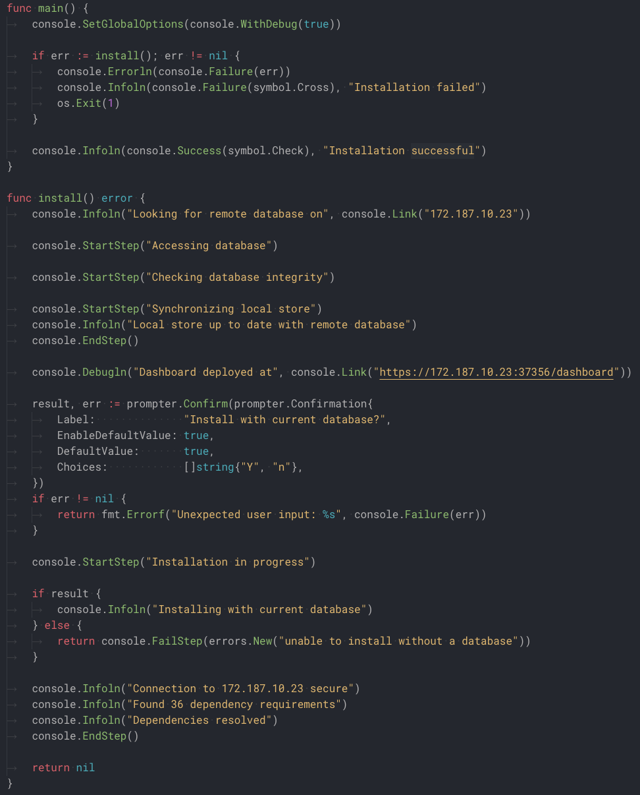
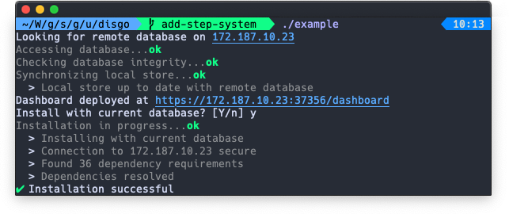
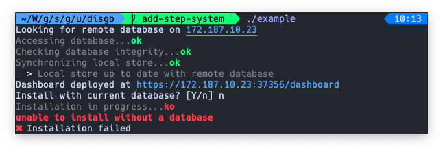
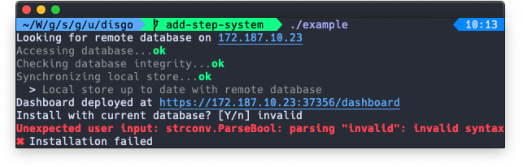

# Disgo

    

    
    
    
    

Simple console output library for Go command-line interfaces.

Disgo provides four essential features for most user-friendly CLI applications:

1. Simple output levels (in `github.com/Ullaakut/disgo/console`)
2. Output formatting (in `github.com/Ullaakut/disgo/console`)
3. Step-by-step outputs (in `github.com/Ullaakut/disgo/console`)
4. Simple user prompting (in `github.com/Ullaakut/disgo/prompter`)

## Example code and outputs

| Code | Results |
| :--- |  :---:  |
|    |   
