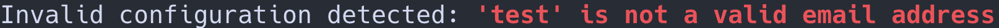
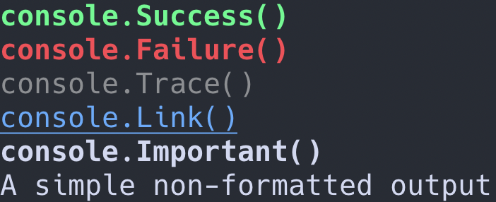
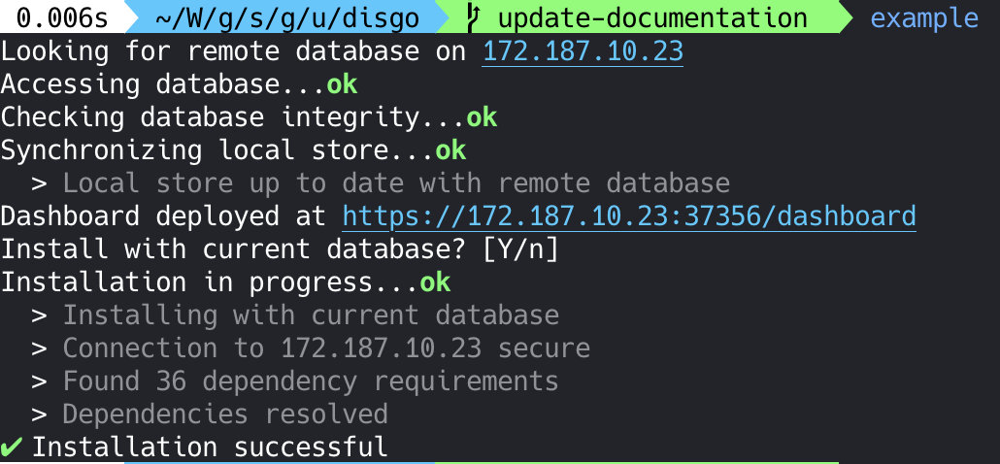
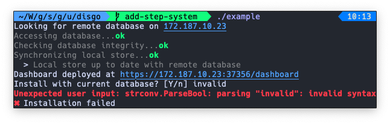

# Disgo

<p align="center">
    
</p>
<p align="center">
    <a href="#license">
        
    </a>
    <a href="https://godoc.org/github.com/Ullaakut/disgo">
        
    </a>
    <a href="https://goreportcard.com/report/github.com/Ullaakut/disgo">
        
    </a>
    <a href="https://github.com/Ullaakut/disgo/releases/latest">
        
    </a>
</p>

Simple console output library for Go command-line interfaces.

Disgo provides four essential features for most user-friendly CLI applications:

1. Simple output levels
2. Output formatting
3. Step-by-step outputs
4. Simple user prompting

## Table of content

1. [Console](#console)
    1. [Console options](#console-options)
    2. [Writing to the Console](#writing-to-the-console)
    3. [Output Formatting](#output-formatting)
    4. [Step-by-step processes](#step-by-step-processes)
    5. [Symbols](#symbols)
2. [Prompter](#prompter)
    1. [Confirmation prompt](#confirmation-prompt)
    2. [String input prompt](#string-input-prompt)
3. [Examples](#examples)
4. [License](#license)

## Console

The disgo `Console` provides an idiomatic way to build user-friendly command-line interfaces.

You can use it globally within your application, or you can instantiate your own `Console`.

### Console options

When creating a `Console` instance or when using the global `Console` that this package provides, you might want to give it some options, such as:

- **`WithDebug`**, which lets you enable or disable the debug output _(it is disabled by default)_
- **`WithDefaultWriter`**, which lets you specify an `io.Writer` on which `Debug` and `Info`-level outputs should be written _(it is set to `os.Stdout` by default)_
- **`WithErrorWriter`**, which lets you specify an `io.Writer` on which `Error`-level outputs should be written _(it is set to `os.Stderr` by default)_
- **`WithColors`**, which lets you explicitely enable or disable colors in your output _(it is enabled by default)_

You can either pass those options to `disgo.NewConsole()` when creating a `Console` instance, like so:

```go
    myConsole := disgo.New(disgo.WithDebug(true))
```

Or, if you are using the global console, you will simply need to call the `SetupGlobalConsole` function:

```go
    disgo.SetupGlobalConsole(disgo.WithDebug(true))
```

### Writing to the Console

Now that your console is set up, you can start writing on it. Printing functions behave idiomatically, like you would expect.

Here is how to use them on a local console:

```go
    // All of those give the same output:
    // "Number of days in a year: 365" followed by a newline.
    myConsole.Infoln("Number of days in a year:", 365)
    myConsole.Infof("Number of days in a year: %d\n", 365)
    myConsole.Info("Number of days in a year: 365\n")

    // Debug methods are similar to info, except that they are not printed
    // if debug outputs are not enabled on the console.
    myConsole.Debugln("Number of days in a year:", 365)
    myConsole.Debugf("Number of days in a year: %d\n", 365)
    myConsole.Debug("Number of days in a year: 365\n")


    // Error methods are similar to info, except that they are written on
    // the error writer (os.Stderr by default).
    myConsole.Errorln("Number of days in a year:", 365)
    myConsole.Errorf("Number of days in a year: %d\n", 365)
    myConsole.Error("Number of days in a year: 365\n")
```

When using the global console, call the console printing functions directly:

```go
    // All of those give the same output:
    // "Number of days in a year: 365" followed by a newline.
    disgo.Infoln("Number of days in a year:", 365)
    disgo.Infof("Number of days in a year: %d\n", 365)
    disgo.Info("Number of days in a year: 365\n")

    // Debug methods are similar to info, except that they are not printed
    // if debug outputs are not enabled on the console.
    disgo.Debugln("Number of days in a year:", 365)
    disgo.Debugf("Number of days in a year: %d\n", 365)
    disgo.Debug("Number of days in a year: 365\n")


    // Error methods are similar to info, except that they are written on
    // the error writer (os.Stderr by default).
    disgo.Errorln("Number of days in a year:", 365)
    disgo.Errorf("Number of days in a year: %d\n", 365)
    disgo.Error("Number of days in a year: 365\n")
```

### Output Formatting

Another feature provided by this package is **output formatting**. It exposes six different output formats, which will print an output with a specific color, font-weight and font-style depending on what the output's content should convey to the user. For example, if you want to attract a user's attention to an error, you might use the `disgo.Failure()` formatting function, like so:

```go
    if err := validateConfiguration; err != nil {
        disgo.Errorln("Invalid configuration detected:", disgo.Failure(err))
        return err
    }
```

<p align="center">
    
</p>

Other output formats include `Success`, `Trace`, `Important` and `Link`.

<p align="center">
    
</p>

You can of course combine those formats in elegant ways, like shown in the [examples](#examples) section.

### Step-by-step processes

A lot of command-line interfaces describe **step-by-step processes** to the user, but it's difficult to combine clean code, clear output and elegant user interfaces. Disgo attempts to solve that problem by associating _steps_ to its console.

For example, when beginning a task, you can use `StartStep` and specify the description of that step. Then, until that task is over, all calls to Disgo's printing functions will be queued. Once the task is complete (by calling `EndStep`, `FailStep` or by starting another step with `StartStep`), the task status is printed and all of the outputs that were queued during the task are printed with an indent, under the task, like so:

<p align="center">
    
</p>

It is also important to note that **`FailStep` and `FailStepf` can be used to return errors** at the same time as they report a step as having failed. This allows you to write:

```go
    disgo.StartStep("Doing something")
    if err := doSomething(); err != nil {
        return disgo.FailStepf("unable to do something: %v", err)
    }
```

Instead of having to call `FailStep` in your error handling before returning. You are still free to do so if you prefer, though.

Using the global console for step management is not thread-safe though, as it was built with simplicity in mind and can only handle one step at a time.

## Prompter

The `Prompter` is not yet complete, as it only handles confirmation prompts for now. Its goal is to provide simple functions to prompt users for information.

### Confirmation prompt

The confirmation prompt lets you **prompt users** for a yes or no answer.

```go
    result, err := disgo.Confirm(disgo.Confirmation{
        Label:              "Install with current database?",
    })
```

Will produce the following output:

```bash
Install with current database? [y/n]
```

To which the user can answer by `y`, `n`, `Y`, `N`, `yes`, `no`, `YES,` `NO`, `0`, `1`, `true`, `false`, etc.

The confirmation prompt supports default values, like so:

```go
    result, err := disgo.Confirm(disgo.Confirmation{
        EnableDefaultValue: true,
        DefaultValue:       false,
        Label:              "Install with current database?",
    })
```

This will set the default value to false, so that when the user does not have access to a TTY or that he simply presses enter to skip the prompt, a value of your choosing is used.

It's also possible to add **your own confirmation parsers**, if you don't want the user to answer to a yes/no question for example. This also means that you can customize the choices that will be presented to the user:

```go
    result, err := disgo.Confirm(disgo.Confirmation{
        Label:              "Install with current database?",
        Choices:            []string{"yes", "no"},
        Parser:             func(input string) (bool, error) {
            switch input {
            case "yes":
                return true, nil
            case "no":
                return false, nil
            default:
                return false, fmt.Errorf("invalid input %q", input)
            }
        },
    })
```

This will output:

```bash
Install with current database? [yes/no]
```

And will use a custom parser for parsing the user's answer.

### String input prompt

Not implemented yet.

## Symbols

Disgo provides **aliases to UTF-8 characters** that could be useful to build your command-line interfaces.

```go
    disgo.Infoln(disgo.SymbolCheck) // ✔
    disgo.Infoln(disgo.SymbolCross) // ✖
    disgo.Infoln(disgo.LeftArrow) // ❮
    disgo.Infoln(disgo.RightArrow) // ❯
    disgo.Infoln(disgo.LeftTriangle) // ◀
    disgo.Infoln(disgo.RightTriangle) // ▶
```

## Examples

Here are a few examples of Disgo's output, using this repository's example program:

<p align="center">
    <br/>
    <br/>
    
</p>

## License

MIT License

Copyright (c) 2019

Permission is hereby granted, free of charge, to any person obtaining a copy
of this software and associated documentation files (the "Software"), to deal
in the Software without restriction, including without limitation the rights
to use, copy, modify, merge, publish, distribute, sublicense, and/or sell
copies of the Software, and to permit persons to whom the Software is
furnished to do so, subject to the following conditions:

The above copyright notice and this permission notice shall be included in all
copies or substantial portions of the Software.

THE SOFTWARE IS PROVIDED "AS IS", WITHOUT WARRANTY OF ANY KIND, EXPRESS OR
IMPLIED, INCLUDING BUT NOT LIMITED TO THE WARRANTIES OF MERCHANTABILITY,
FITNESS FOR A PARTICULAR PURPOSE AND NONINFRINGEMENT. IN NO EVENT SHALL THE
AUTHORS OR COPYRIGHT HOLDERS BE LIABLE FOR ANY CLAIM, DAMAGES OR OTHER
LIABILITY, WHETHER IN AN ACTION OF CONTRACT, TORT OR OTHERWISE, ARISING FROM,
OUT OF OR IN CONNECTION WITH THE SOFTWARE OR THE USE OR OTHER DEALINGS IN THE
SOFTWARE.
